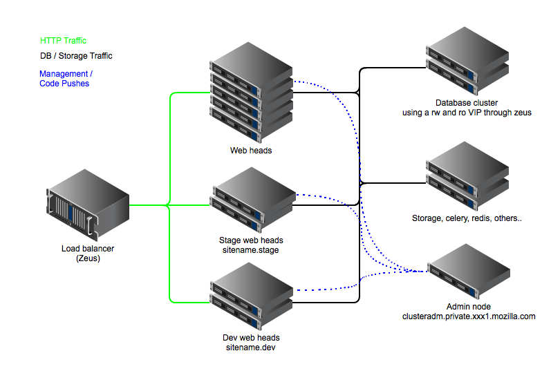
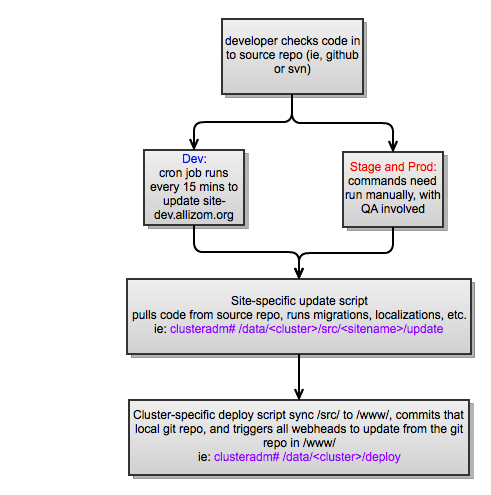

!SLIDE

# Web Apps!

* Apache / mod_wsgi
* Usually Django / MySQL
* NFS on NetApp for shared media

!SLIDE

# Services

* Caching: Memcache
* Search: Sphinx (older) / ElasticSearch (newer)
* Workers: Celery queues, feed by RabbitMQ
* Some Redis as a lightweight database

!SLIDE

# Monitoring

* System Performance: Ganglia
* Application Performance: Graphite/StatsD
* Alerting: Nagios

!SLIDE

# Infrastructure

* dev/stage/prod
* everything load balanced
* services are built in clusters

!SLIDE

# Clusters

 * generic clusters for smaller apps
 * dedicated clusters for some larger apps
 * admin node

!SLIDE

# Admin node is

 * where code updates are pulled to
 * where deploys are done from

!SLIDE

# Architecture



!SLIDE

# deploying

* app code is in ```/data/{dev|stage|prod}/src/site/code```
* since most our apps are open source, certain settings file aren't in
  public repos
* update script is run
* update script calls deploy script (commander wrapper)

!SLIDE

# deploy diagram



!SLIDE

# Update script

* each gets an update script written for it
* most of the scripts are the same

!SLIDE smaller

# update script runs

* git pull
* update vendor submodule
* any admin tasks, like compressing assets, database migrations
* code is rsync'd to /data/{dev|stage|prod}/www/ , rsync strips out .git, .hg, etc
* once code is rsync, it's checked into an internal git repo to keep revision of non-public files
* deploy script (fabric code) is called which kicks off a pull on each web server
* once all the web server pulls have kicked off, script exits
 
!SLIDE code

# Example Deploy output
```(bburton@genericadm) $ sudo -i /data/genericrhel6-dev/deploy caseconductor-dev```
```[localhost] running: /usr/bin/rsync -aq --include '.gitkeep' --exclude '.git*' --exclude ```
``` '.hg*' --delete /data/genericrhel6-dev/src/caseconductor-dev./ ```
``` /data/genericrhel6-dev/www/caseconductor-dev./```
```[localhost] finished: /usr/bin/rsync -aq --include '.gitkeep' --exclude '.git*' --exclude ```
``` '.hg*' --delete /data/genericrhel6-dev/src/caseconductor-dev./ ```
```/data/genericrhel6-dev/www/caseconductor-dev./ (2.475s)```
```[localhost] running: cd /data/genericrhel6-dev/www && /usr/bin/git add .; ```
``` /usr/bin/git commit -a -m 'deploy'```
```[localhost] finished: cd /data/genericrhel6-dev/www && /usr/bin/git add .; ```
``` /usr/bin/git commit -a -m 'deploy' (6.926s)```
```[localhost] out: # On branch master```
```[localhost] out: nothing to commit (working directory clean)```
```[generic1.dev.seamicro.phx1.mozilla.com] running: /data/bin/update-www.sh caseconductor-dev.```
```[generic2.dev.seamicro.phx1.mozilla.com] running: /data/bin/update-www.sh caseconductor-dev.```
```[generic2.dev.seamicro.phx1.mozilla.com] finished: /data/bin/update-www.sh caseconductor-dev. (14.283s)```
```[generic1.dev.seamicro.phx1.mozilla.com] finished: /data/bin/update-www.sh caseconductor-dev. (14.718s)```
 
!SLIDE

# tools

* [Commander](https://github.com/oremj/commander) - fabric like
* [Chief](https://github.com/oremj/chief) - simple web ui for Commander

!SLIDE

# What's next?

* continuous delivery
* internal iaas/paas
* vagrant
* community it

!SLIDE

# continuous 
# delivery?

* driven by jenkins?
* unit/integration tests as part of deploy
* phased rollouts

!SLIDE

# IaaS/PaaS?

[Project Petri](https://wiki.mozilla.org/Petri)

### Project Petri is a 1-year experiment in providing a Platform-as-a-service (PaaS) and/or Infrastructure-as-a-Service (IaaS) offering

!SLIDE

# IaaS Options

* OpenStack
* Eucalyptus
* OpenNebula
* Etc

!SLIDE

# PaaS Options

* CloudFoundry
* Stackato
* RedHat OpenShift

!SLIDE

# PoC
## Eucalyptus 3.0
## Cloud Foundry
 
!SLIDE

# Vagrant

* some webapps already ship with Vagrantfiles
* IT provide Vagrantfiles that are close to prod
* both single instance and multiple server

!SLIDE

# Community IT

 * [Growing Mozilla Community IT](http://blog.mozilla.com/mrz/2012/01/30/mozilla-it-growing-community/)
 * Opening up some of our internal configs, code, etc

!SLIDE

# Stuff to share
  
  * Puppet code (modules/manifests/etc)
  * Yum Repos
  * Deploy Scripts

!SLIDE

# Questions?
